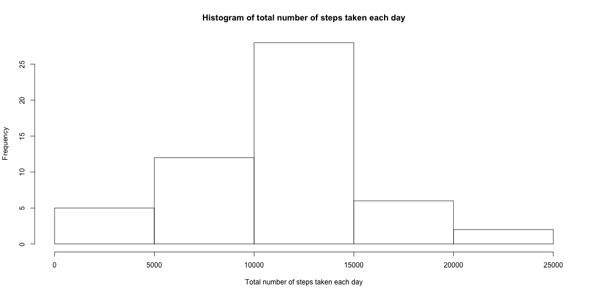
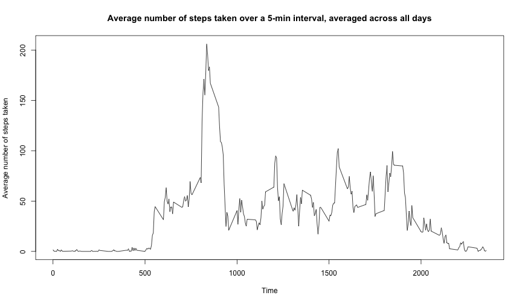
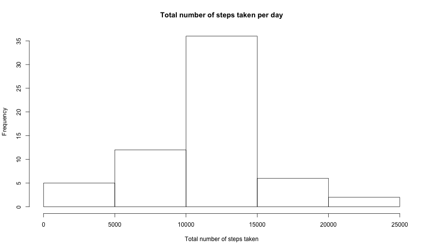
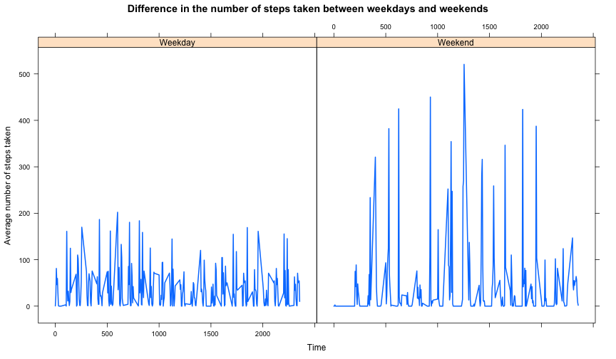

```r
knitr::opts_chunk$set(echo = TRUE, cache = TRUE)
```

## Loading and preprocessing the data


```r
library(lattice)
setwd("~/RepData_PeerAssessment1")
activity_df <- read.csv("activity.csv", header = T, na.strings = "NA")
```


```r
# Convert date column to date variable
activity_df$date <- as.Date(activity_df$date, format = "%Y-%m-%d")

# Convert Interval to %H%M format
for (i in 1:dim(activity_df)[1]){
        if (activity_df$interval[i] < 10){
                activity_df$HM[i] <- paste("000", activity_df$interval[i], sep = "")
        } else if (activity_df$interval[i] < 100){
                activity_df$HM[i] <- paste("00", activity_df$interval[i], sep = "")
        } else if (activity_df$interval[i] < 1000){
                activity_df$HM[i] <- paste("0", activity_df$interval[i], sep = "")
        } else {
                activity_df$HM[i] <- paste("", activity_df$interval[i], sep = "")
        }
}
```

## What is mean total number of steps taken per day?

Histogram of the total number of steps taken each day


```r
df_mean_total_no_of_steps <- activity_df[complete.cases(activity_df), ]
hist(tapply(df_mean_total_no_of_steps$steps, df_mean_total_no_of_steps$date, sum, na.rm = T),
     xlab = "Total number of steps taken each day", ylab = "Frequency",
     main = "Histogram of total number of steps taken each day") 
```



Calculating the mean and median total number of steps taken per day


```r
mean_total_per_day <- mean(tapply(df_mean_total_no_of_steps$steps, df_mean_total_no_of_steps$date, sum, na.rm = T), na.rm = T)
median_total_per_day <- median(tapply(df_mean_total_no_of_steps$steps, df_mean_total_no_of_steps$date, sum, na.rm = T), na.rm = T)
mean_total_per_day = as.numeric(mean_total_per_day)
```

The mean total number of steps taken per day is 1.0766189 &times; 10<sup>4</sup>.

The median total number of steps taken per day is 10765.

## What is the average daily activity pattern?

Time series plot of 5 minutes interval (x-axis) and the average number of steps taken, averaged across all days (y-axis)

```r
plot(sort(unique(activity_df$HM)), tapply(activity_df$steps, activity_df$HM, mean, na.rm = T),
     xlab = "Time", ylab = "Average number of steps taken", type = "l",
     main = "Average number of steps taken over a 5-min interval, averaged across all days")
```




```r
avg_steps_by_5min <- tapply(activity_df$steps, activity_df$HM, mean, na.rm = T)
top_5min_int <- activity_df$HM[which(avg_steps_by_5min == max(avg_steps_by_5min))]
max_5min_steps <- avg_steps_by_5min[which(avg_steps_by_5min == max(avg_steps_by_5min))]
```

The 5 minute interval from 0835 contains the maximum number of steps (206.1698113).

## Imputing missing values

Calculating the total number of missing values in the dataset

```r
no_of_missing_values <- sum(is.na(activity_df))
```

The total number of missing values in the dataset is 2304.

To imput the missing values for each 5 minute interval, we will use the average steps taken over the 5 minute interval.

```r
activity_df_imputed <- activity_df
for (i in 1:dim(activity_df_imputed)[1]){
        if (is.na(activity_df$steps[i])){
                activity_df_imputed$steps[i] <- mean(activity_df$steps[activity_df$HM == activity_df$HM[i]], na.rm = T)
        }
}
```

Before Imputing Missing Values

```r
head(activity_df)
```

```
##   steps       date interval   HM
## 1    NA 2012-10-01        0 0000
## 2    NA 2012-10-01        5 0005
## 3    NA 2012-10-01       10 0010
## 4    NA 2012-10-01       15 0015
## 5    NA 2012-10-01       20 0020
## 6    NA 2012-10-01       25 0025
```

After Imputing Missing Values

```r
head(activity_df_imputed)
```

```
##       steps       date interval   HM
## 1 1.7169811 2012-10-01        0 0000
## 2 0.3396226 2012-10-01        5 0005
## 3 0.1320755 2012-10-01       10 0010
## 4 0.1509434 2012-10-01       15 0015
## 5 0.0754717 2012-10-01       20 0020
## 6 2.0943396 2012-10-01       25 0025
```

Histogram of total number of steps taken per day after imputing missing values


```r
hist(tapply(activity_df_imputed$steps, activity_df_imputed$date, sum),
     xlab = "Total number of steps taken", ylab = "Frequency",
     main = "Total number of steps taken per day")
```



Calculating Mean and Median steps taken per day after imputing missing values


```r
imputed_mean_no_of_steps <- mean(tapply(activity_df_imputed$steps, activity_df_imputed$date, sum, na.rm = T))
imputed_median_no_of_steps <- (tapply(activity_df_imputed$steps, activity_df_imputed$date, sum, na.rm = T))
```

The mean total number of steps taken per day after imputing the missing values is 1.0766189 &times; 10<sup>4</sup>.

The median total number of steps taken per day after imputing the missing values is 10765.

After imputing the missing values, the mean and median total number of steps taken per day does not appear to change dramatically. Of course, this is a feature and not a bug, since we have used the average steps taken over the 5 minute interval to fill in the missing values. Hence, we do not expect the number of steps to change drastically.

## Are there differences in activity patterns between weekdays and weekends?

Creating a new factor variable to differentiate between weekdays and weekends

```r
for (i in 1:dim(activity_df_imputed)[1]){
        if (format(activity_df_imputed$date[i], "%a")  %in% c("Sat", "Sun")){
                activity_df_imputed$weekday[i] <- "Weekend" 
        } else {
                activity_df_imputed$weekday[i] <- "Weekday"
        }
}
```

Creating a facet plot to see the differences in the activity patterns between weekdays and weekends

```r
activity_df_imputed$HM_weekday <- paste(activity_df_imputed$weekday, activity_df_imputed$HM, sep = "")

mean_steps_by_HM_weekend <- tapply(activity_df_imputed$steps, sort(activity_df_imputed$HM_weekday), mean)

df_mean_steps_by_HM_weekend <- data.frame(mean_steps_by_HM_weekend)
df_mean_steps_by_HM_weekend$weekday <- as.factor(substr(sort(unique(activity_df_imputed$HM_weekday)), 1, 7))
df_mean_steps_by_HM_weekend$HM <- substr(sort(unique(activity_df_imputed$HM_weekday)), 8, 11)

xyplot(mean_steps_by_HM_weekend ~ as.numeric(HM) | weekday, 
       data = df_mean_steps_by_HM_weekend,
       type = "l", lwd = 2,
       xlab = "Time", ylab = "Average number of steps taken",
       main = "Difference in the number of steps taken between weekdays and weekends")
```



